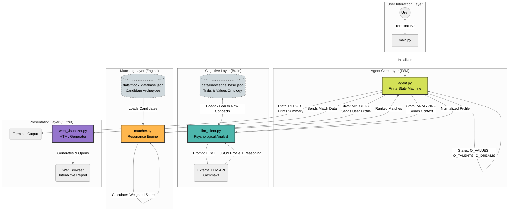

# ((o)) Resonance: AI-Powered Life Design Agent

> **TOC 2025 Final Project**
>
> Moving beyond keyword matching to understand the *psychological intent* behind human potential.

---

## 📖 專案簡介 (Introduction)

**Resonance** 不僅僅是一個配對工具，它是基於大型語言模型 (LLM) 的**心理分析代理人 (Psychological Profiler Agent)**。

傳統的配對系統依賴表面的關鍵字對應（例如：使用者說 "Python" -> 配對 "工程師"）。Resonance 則透過先進的 Prompt Engineering 技術——包含 **思維鏈 (Chain of Thought)**、**情緒過濾 (Sentiment Filtering)** 與 **特質重構 (Reframing)**——深入解讀使用者回答背後的「意圖」，識別其內在天賦、核心價值與深層動機。

系統最終會將使用者與資料庫中的原型人物進行共振配對，並生成一份動態的「靈魂光譜 (Resonance Spectrum)」網頁報告。

## 🧠 核心創新：心理學分析框架 (Psychological Framework)

本系統的狀態機 (FSM) 設計圍繞著一套特定的心理學訪談邏輯。我們不問你「會做什麼」，而是問你「如何回應世界」。

| 訪談階段 (FSM State) | 提問策略 (Question Strategy) | 背後的心理學洞察 (LLM Task) |
| :--- | :--- | :--- |
| **Stage 1: Values** | "你崇拜誰？為什麼？" | **不可妥協的原則 (Principles):** 透過崇拜對象投射出使用者的人生標準。 |
| **Stage 2: Talents** | "你對什麼感到不耐煩？" | **天賦的鏡像 (Mirroring):** 對他人的不耐煩，往往反映了使用者自身毫不費力的天賦 (e.g., 討厭混亂 = 結構化思維)。 |
| **Stage 3: Dreams** | "什麼社會問題讓你憤怒？" | **內在驅動力 (Constructive Anger):** 區分「厭惡 (Aversion)」與「想改變的動力 (Drive)」。 |

## ✨ 關鍵技術特點 (Key Features)

* **🧠 深度意圖分析 (Chain of Thought):** 系統不會只輸出標籤。它強制 LLM 先進行 `reasoning` 推理，解釋如何從模糊的口語中推導出心理特質。
* **🔄 特質重構機制 (Reframing Logic):** 自動將看似負面的特質轉化為正向優勢（例如：將「偷懶/無為」重構為「策略性效率」）。
* **🛡️ 建設性憤怒過濾器 (Anger Filter):** 智慧分辨使用者是單純「討厭」某事（排除），還是對某事感到憤怒並「想改變它」（納入夢想）。
* **🌱 自適應知識庫 (Self-Learning Knowledge Base):** 系統內建心理學本體論，並能隨著對話動態學習新概念 (`knowledge_base.json`)。
* **📊 去技能化配對 (De-skilling Matching):** 配對基礎是「認知特質 (Traits)」而非「硬技能 (Skills)」，實現跨領域的靈魂共振。
* **🌐 高保真網頁視覺化 (High-Fidelity Web Viz):** 自動生成互動式 HTML 報告，以堆疊長條圖呈現共振細節。

## 🏗️ 系統架構 (System Architecture)

本系統採用模組化設計，由有限狀態機 (FSM) 驅動數據流：

📂 檔案結構
Plaintext

.
├── data/
│   ├── knowledge_base.json  # 心理特質本體論 (具備學習能力)
│   └── mock_database.json   # 已去技能化的候選人原型資料庫
├── src/
│   ├── agent.py             # FSM 狀態機核心
│   ├── llm_client.py        # LLM 串接與 Prompt Engineering
│   ├── matcher.py           # 共振加權演算法
│   ├── utils.py             # 工具函式
│   └── web_visualizer.py    # 動態網頁生成器
├── main.py                  # 程式進入點
├── README.md                # 說明文件
└── requirements.txt         # 相依套件
🚀 快速開始
安裝套件:

Bash

pip install -r requirements.txt
執行程式:

Bash

python main.py
進行訪談: 依照心理學引導回答三個問題。

查看結果: 終端機將顯示分析摘要，瀏覽器將自動彈出詳細的視覺化報告。
